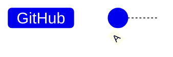
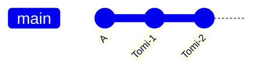
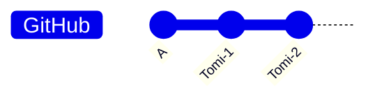
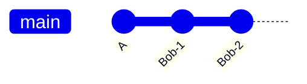
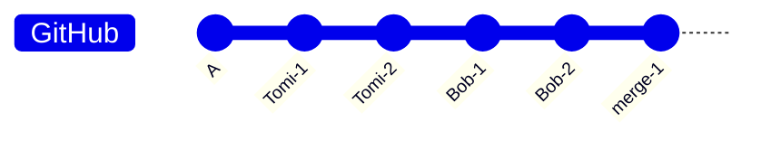
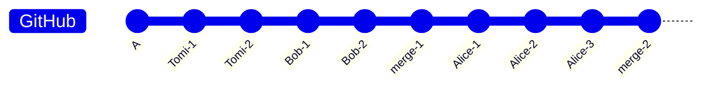
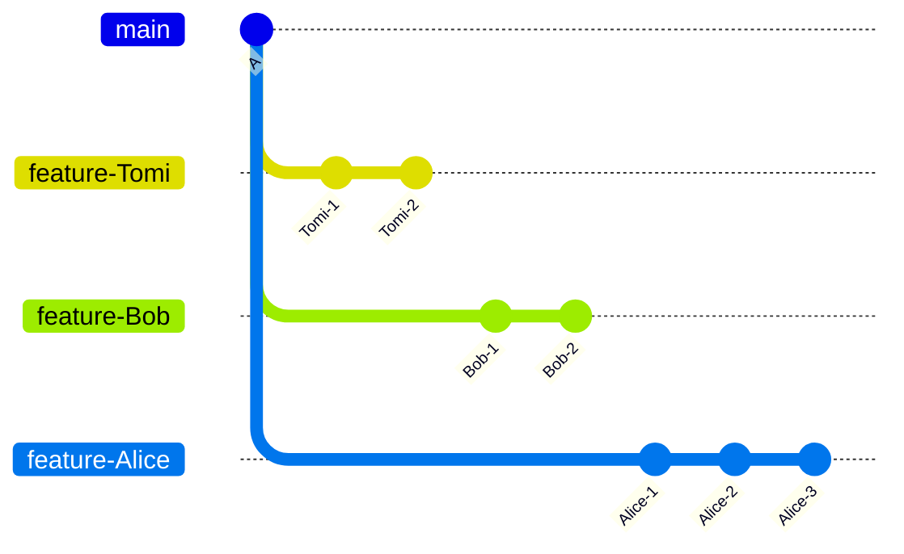
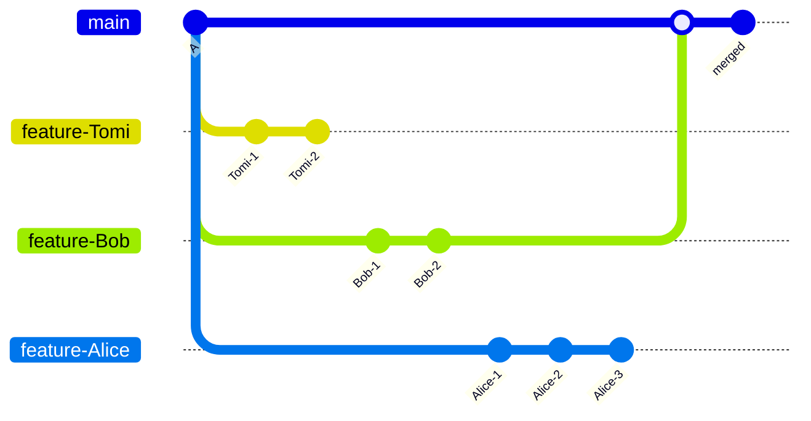

# Feature Branches Workflow

Now that we understand how to work with remotes and remote branches, 
let's discuss the approach—or rather, the workflow—used to manage them effectively.

## Why not centralized workflow ⁉️

Before I demonstrate why this approach is recommended (**Feature Branches**), let's first take a look at **what not to do (centralized workflow)**, 
practices that are less ideal for teamwork, especially in larger teams.

Imagine a scenario where three developers are working on the same `main` branch,  
**Tomi**, **Bob** and **Alice**, and have init commit `A`.

**Tomi** cloned the repo and start to work on his feature, and add two commits.

And then he pushed it to GitHub without any issues.

At the same time, **Bob** is working on his feature.

He wants to push his changes to GitHub, but he can't because his branch is two commits behind the remote branch. 
So, Bob first needs to pull the latest changes and merge them with his own. 
Luckily for Bob, there are no conflicts. Now, he can successfully push his changes.

After all this, poor **Alice** has been working all day on a feature and has made three commits. 
He wants to push her changes, but like Bob, he needs to pull the latest updates first. 
Unfortunately, unlike Bob, Alice encounters multiple conflicts.  
After spending a lot of time, he finally managed to resolve the conflicts.

You get the idea, what happens if we have four or five developers? It starts to become overwhelming. 
And we haven't even discussed what happens if someone pushes code with an issue, ot not finish his feature, it could affect everyone.

## Nobody works on main

Rather then working directly on `main` ( or `master`), all new development should be done on separate branches

✅ **Why Use Feature Branches?**

- Keeps `main` Stable – Prevents unfinished or buggy code from affecting production.
- Easier Collaboration – Developers work independently without interfering with each other.
- Enables Code Reviews – Pull requests allow for feedback and approval before merging.
- Reduces Merge Conflicts – Isolating changes minimizes conflicts when merging.
- Better Version Control – Tracks features separately, making changes easier to manage.

🔄 **Typical Workflow**

- Create a feature branch
- Work on changes and commit.
- Push the branch
- Open a pull request for review
- Merge into main once approved.

 
Imagine a scenario where three developers are working on the same repository,  
Tomi, Bob and Alice, and have init commit `A` on the `main` branch.  
And every developer work on his branch

When a developer finishes their work (feature), they can merge it into `main`
> **Note** 
> In a real word scenario, you don't just decide you are "happy with" a feature. 
> There are mechanisms for code approval and merging (pull request) that **I will cover in the next sections**.

> Keep in mind that branches don't have to be personal as I showed in this scenario. 
> The idea is to create feature branches that can be shared with some teammates without disrupting others.

 
