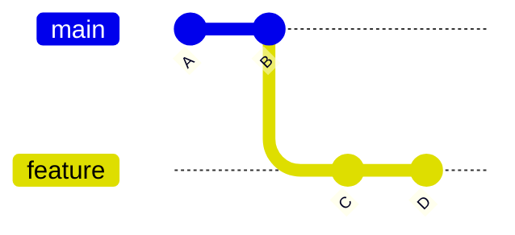
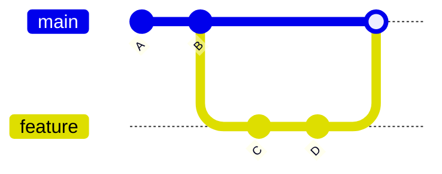
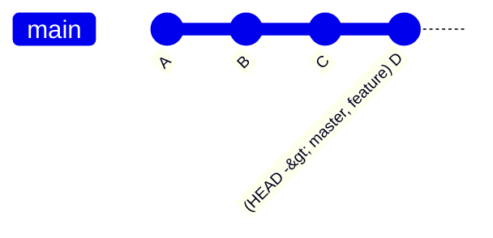
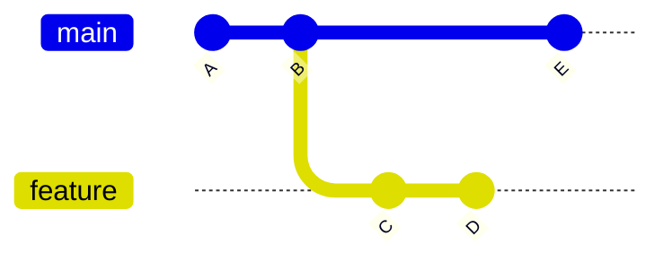
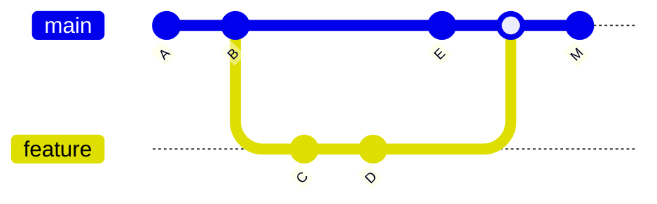
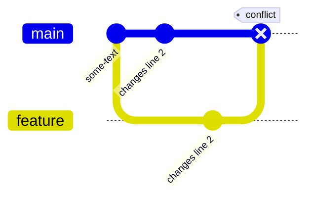
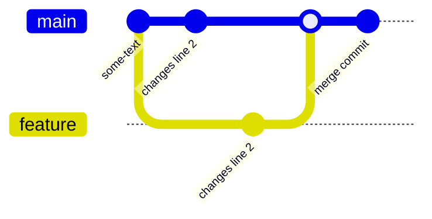

# Understanding Git Merge

This section focuses on working with Git in local repositories.<br />
In future sections, I will demonstrate how to work with remote repositories on platforms like GitHub and GitLab.

## Fast-Forward Merge

**Scenario**

You create a new branch `feature` from `master`, make commits, and `master` remains unchanged in the meantime.

**Diagram:**



 **A** and **B** are commits on `master`.
- You create `feature` branch at **B**.
- Commits **C** and **D** happen on `feature` only.
- `master` has not moved beyond **B** since `feature` branched off.

When you merge `feature` into `master`, Git sees that `master` can simply "fast-forward" to **D**, because `master` has no new commits of its own. The `master` pointer just moves forward to `D`.

**Commands:**

```bash
# Ensure you're on master
git checkout master

# Merge feature into master with a fast-forward
git merge feature
```

The result is:



And using git history:
```bash
git log --oneline --graph
```



<br>
<br>

## Non-Fast-Forward (True Merge Commit)

**Scenario**

You create `feature` from `master`, but while working on `feature`, someone makes additional commits directly on `master`. Now you have diverging lines of development:

Diagram:



- **A** and **B** are original commits on `master`.
- You branch `feature` from **B**, and make commits **C** and **D** there.
- Meanwhile, `master` has a new commit **E** after you branched off.
- When merging `feature` into `master`, Git can’t just fast-forward because `master` has moved on separately. Instead, it creates a new merge commit:



**Commands:**

```bash
# Ensure you're on master
git checkout master

# Merge feature into master - Git will create a new merge commit
git merge feature
```

Now, `master` contains a merge commit **M** that records both lines of history.

<br>
<br>


## Handling Merge Conflicts

**Scenario**

While merging, you may encounter a **conflict** if both `master` and `feature` modify the same portion of a file differently. Git will stop the merge and prompt you to resolve the conflict manually.

Diagram:



When merging, Git finds that `Line 2` was changed in both branches but with different content.

```bash
# Ensure you're on master
git checkout master

# Merge feature into master - Git will create a new merge commit
git merge feature
```

Git stops and reports a conflict. Open the conflicted file. You’ll see conflict markers like this:

```text
<<<<<<< HEAD
Line 2 changed in master
=======
Line 2 changed in feature
>>>>>>> feature
```

Choose how to resolve the conflict. For example, if you decide to keep feature’s change:

```text
Line 1
Line 2 changed in feature
Line 3
```

After fixing conflicts, stage the resolved files adn commit:

```bash
git add <file_name>
git commit
```

And the result:

