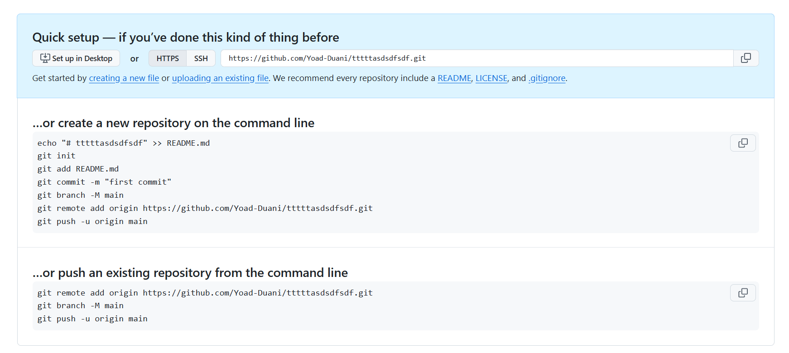

# Understanding Git Remotes

Git **remotes** are simply references (pointers) to remote repositories—usually hosted on platforms like GitHub—that allow you to collaborate on code, fetch updates from others, and push your own changes.

---

## Cloning a Repository and Checking Remotes

- **Clone from GitHub**  
   Suppose you run:
   ```bash
   git clone https://github.com/username/example-repo.git
   ```
   This command copies the remote repository to your local machine.

- **Check Remotes**  
   After the clone is complete, navigate into the project folder:
   ```bash
   cd example-repo
   ```
   Then run:
   ```bash
   git remote -v
   ```
- The `-v` flag stands for "verbose" and shows you the list of remote connections and their corresponding URLs. You typically see something like:
     ```
     origin  https://github.com/username/example-repo.git (fetch)
     origin  https://github.com/username/example-repo.git (push)
     ```
     - **Origin** is the default name Git assigns to the main remote repository you cloned from.
     - This means your local repo is linked to that remote URL.  

When you use `git pull`, Git automatically fetches and merges changes from the **origin** remote by default (unless you specify otherwise), meaning it pulls updates from that URL.

---

## Creating a New Local Repository and Connecting to GitHub

If you've ever tried to create a new empty repository on GitHub, you've probably seen these instructions:



As you can see, it adds a remote to the local Git repository

1. **Initialize Local Repository**  
   First, create a new project folder and initialize Git:
   ```bash
   mkdir new-project
   cd new-project
   git init
   ```
   This creates an empty local Git repository in the `new-project` folder.

2. **Create a New Repo on GitHub**  
   Go to GitHub, create a **new repository**, and copy its remote URL (for example, `https://github.com/username/new-project.git`).

3. **Add the Remote**  
   Back in your local terminal, you add your GitHub repository as the **origin** remote:
   ```bash
   git remote add origin https://github.com/username/new-project.git
   ```
    **Explanation**: `git remote add origin <URL>` associates the name **origin** with the remote repository you just created on GitHub. This is the link between your local repo and the remote repo.

4. **Verify the Remote**  
   Use the `git remote -v` command again:
   ```bash
   git remote -v
   ```
   You should now see something like:
   ```
   origin  https://github.com/username/new-project.git (fetch)
   origin  https://github.com/username/new-project.git (push)
   ```
   you can add some remotes to the same repository:
   ```bash
   git remote add gitlab https://gitlab.com/yoad787/argocd-test.git
   ```
   ```bash
   git remote -v
   
   # And the result:
   gitlab  https://gitlab.com/yoad787/argocd-test.git (fetch)
   gitlab  https://gitlab.com/yoad787/argocd-test.git (push)
   origin  git@github.com:Yoad-Duani/personal_notes.git (fetch)
   origin  git@github.com:Yoad-Duani/personal_notes.git (push)
   ```

5. **Push Your Code**  
   Now you can push changes to your GitHub repo:
   ```bash
   git push origin <branch_name>
   ```
   This command sends your local commits from `<branch_name>` to the **origin** remote on GitHub.

---

## Default Branch Considerations

By default, many local Git installations name the initial branch **master**, whereas GitHub (and other platforms) may default to a branch named **main**. To rename the local branch to **main**, you can use:

```bash
git branch -M main
```

This renames the **current** branch to **main** so that it matches the default naming convention on GitHub.

---
## Understanding Git Push

When you run a command like:

```bash
git push origin <branch_name>
```

you're **sending** (pushing) commits from your local `<branch_name>` to the remote repository (usually referred to as `origin`) on the **same** branch name (if you specify `<branch_name>` on both sides). For instance:

```bash
git push origin main
```

pushes your **local main** branch to the **remote main** branch on `origin`.

---

### Pushing Local Branch to a Different Remote Branch

You don't necessarily have to push your local branch to the **same** remote branch name. For example, to push your local `feature2` branch into the remote **main** branch, you can use:

```bash
git push origin feature2:main
```

This will cause the branch `feature2` on your **local** to be published to the **remote repository** as `main`.

---

### Setting Upstream with `git push -u`

Often, you want to link (or **set upstream**) between your local branch and a specific remote branch, so that you can simply type:

```bash
git push
```

without specifying the remote name and branch every time. You can do this with:

```bash
git push -u origin main
```

The `-u` (or `--set-upstream`) flag sets your local **main** branch to track the **main** branch on `origin`. That way, if you are on your local **main** branch, you only need to type `git push` in the future.

> **_NOTE:_**  When you clone a repo, git take care for the **default remote branch**
> and link it to your local branch (usually `main` -> `origin/main`) <br />
> see [Understanding Remote Tracking Branches](#understanding-remote-tracking-branches)
---

**Error When No Upstream Is Set**

If you try to push a branch that doesn't have an upstream set yet, you'll see an error like:

```
fatal: The current branch main has no upstream branch.
To push the current branch and set the remote as upstream, use
    git push --set-upstream origin main
```

This simply means you need to tell Git **where** to push your local commits for that branch. Running the suggested command will set the upstream for the **main** branch on your local machine.

**Example Output**

When you successfully push, you might see output similar to:

```
..
..
To https://github.com/username/my-repo.git
 * [new branch]      main -> main
```

`main -> main` meaning that your **local main branch** pushed to **remote main branch**.

<br /> 


## Understanding Remote Tracking Branches

When you clone a repository or set up a new remote, Git automatically creates **remote tracking branches**. These are references in your local repository that track the state of remote branches. For example, `origin/main` is a remote tracking branch that represents the **main** branch on your remote named `origin`.

### How Remote Tracking Branches Work

A remote tracking branch like `origin/main` is **not** an actual local branch that you can directly commit to. Instead, it updates whenever you do a `git fetch` or `git pull` to show the latest state of the remote's main branch.

Locally, when you run `git log --oneline --graph` <br>
You might see something like this:

```
e0d3332 (HEAD -> main, origin/main)
```

This means:
- **HEAD -> main**: You are currently on the local **main** branch.
- **origin/main**: The remote tracking branch (for your `origin` remote) is at the same commit (here, `e0d3332`), indicating your local main is **in sync** with the remote’s main branch.

### Viewing Remote Branches

You can see what remote branches exist by running:

```bash
git branch -r
```

This command lists **remote** branches, such as:
```
  origin/main
  origin/develop
  origin/featureX
```

Any remote tracking branch that appears here has a corresponding branch in the remote repository. <br />
To get one of these branches locally, and start to work on that you can just run switch:

```bash
git switch featureX
```

This will create a new local branch `featureX` and set it up to track the remote branch `origin/featureX`

> **_NOTE:_**
> The old command used in the past:
> ```bash
> git checkout --track origin/featureX
> ```

so now when you run

```bash
git branch
# You will see the new local branch featureX
main
featureX
```

<br /> 
