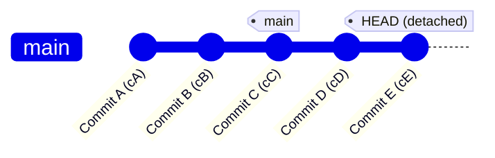
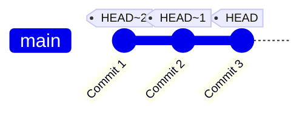
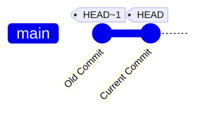
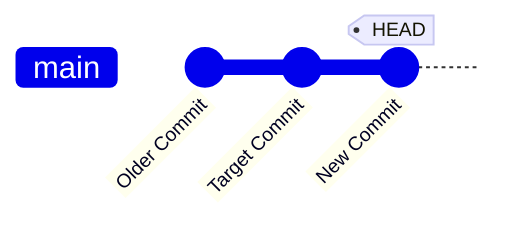
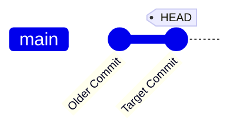
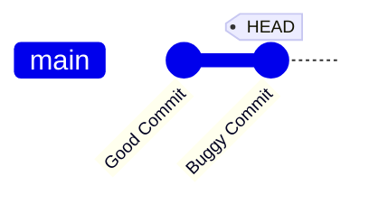
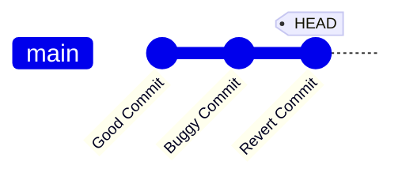

# Understanding Time Traveling In Git

In Git, there are various ways to move through commit history, undo changes, and revert your project to previous states.<br/>
This guide explains different scenarios, including diagrams that illustrate how Git operations work behind the scenes.

This section focuses on working with Git in local repositories.<br />
In future sections, I will demonstrate how to work with remote repositories on platforms like GitHub and GitLab.

## Checking Out a Specific Commit

When you run:

```bash
git checkout <commit-hash>
```

Git will move `HEAD` to point directly to that commit.<br/>
This is known as a detached HEAD state because you’re no longer on a branch,but rather pointing to a specific commit. <br/>
Any commits you make in this state will not belong to any branch until you either create a new branch or re-attach `HEAD` to an existing branch.


**Detached HEAD:**



`git checkout <commit-hash-of-cE>` checks out `Commit E` directly.
`HEAD` is now detached at `Commit E`.

To get back onto a branch (e.g., main), you can run:<br />

```bash
git checkout main
```

Now `HEAD` points back to the tip of main.<br />
Another option is to create a new branch from the detached commit:

```bash
git checkout -b my-new-branch
```

This creates and switches you to `my-new-branch`, attaching `HEAD` to that branch.


**Referencing Commits Relative to `HEAD`**

`HEAD` represents the tip of the current branch.
You can reference commits relative to `HEAD` using notation like `HEAD~1`,
Which means the parent of `HEAD`, or `HEAD~2`, which is the grandparent, and so on.

For example:

- `HEAD~1` is the commit just before your current `HEAD`.
- `HEAD~2` is two commits before `HEAD`.



`HEAD` points to **Commit 3**.<br />
`HEAD~1` would point to **Commit 2**.<br />
`HEAD~2` would point to **Commit 1**.

This is useful for operations like resetting, checking out, or restoring files.

---

## Discarding Changes in a File

Sometimes you edit a file in your working directory but decide you no longer want those changes.<br />
You can revert it back to the version in `HEAD` (your latest commit).

```bash
git checkout HEAD <filename>
```

This command replaces the file in your working directory with the version in HEAD.<br />
Alternatively, the older short form is:

```bash
git checkout -- <filename>
```

In **newer Git versions**, you can achieve the same effect with:

```bash
git restore <filename>
```

This discards all local changes (**change that did not added yet**) in `<filename>` since the last commit on the current branch.

---

## Restoring Files to a Specific Commit

You can restore a file to its state in a specific commit (e.g., `HEAD~1`) using:

```bash
git restore --source HEAD~1 <filename>
```

This does not move `HEAD`; it only updates the file in your working directory to the state it had in `HEAD~1`.



You’re simply pulling the file’s contents from “**Old Commit (HEAD~1)**” into your working directory while staying on “Current Commit (HEAD)”.

**Returning the File to HEAD:** <br />
If you later change your mind and want the version from HEAD again, just run:

```bash
git restore <filename>
```

---

## Unstaging Files

If you’ve staged a file by running `git add <filename>` but then decide you don’t want it in the staging area,
you can unstage it with:

```bash
git restore --staged <filename>
```

This removes `<filename>` from the staging area but leaves your working directory changes intact.

---

## Resetting Commits

`git reset` moves the `HEAD` (and possibly the current branch pointer) to a specified commit.

```bash
git reset <commit-hash>
```

By default, `git reset <commit-hash>` is a **mixed** reset, which moves `HEAD` to `<commit-hash>` and **unstages** any changes that were staged in later commits. However, it usually keeps changes in your working directory.

**Before:**



**After:**


If you now run `git status`
you will see unstages files

If you now run:

```bash
git log --graph --oneline
```

You might see the "**New Commit**" commit is no longer reachable from your current HEAD (unless you do further actions).

To completely discard changes:

```bash
git reset --hard <commit-hash>
```

A **hard** reset discards all changes in both the staging area and your working directory, forcing them to match exactly what’s in `<commit-hash>`.
**Use with caution**, because this can permanently destroy local changes if they haven’t been committed anywhere else.

---

## Reverting Commits

To create a new commit that undoes changes introduced by a previous commit, use:

```bash
git revert <commit-hash>
```

Unlike `git reset`, `git revert` is safe for shared branches because it does not modify commit history.<br />
Instead, it creates a new commit that reverses the changes.

Before:



After:



**Why Use `git revert`?**

- Use **`git revert`** for shared branches to maintain a linear commit history.
- Use **`git reset`** for local branches when you need to rewrite history. <br/> (This can be useful for removing secrets remotely, which will be described in the next sections)
