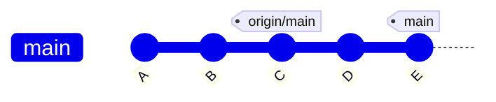
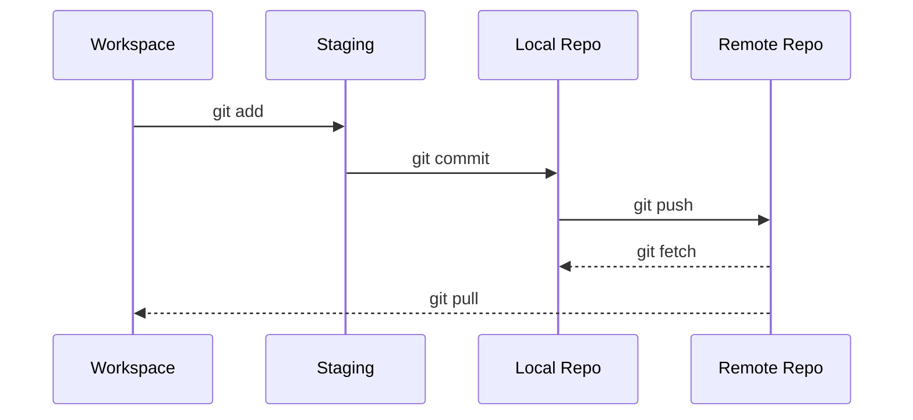
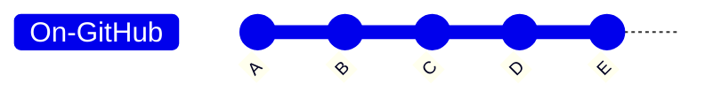
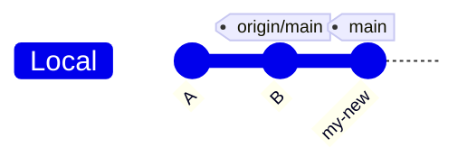
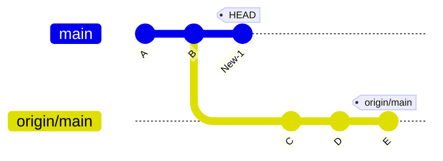
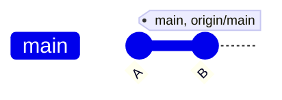
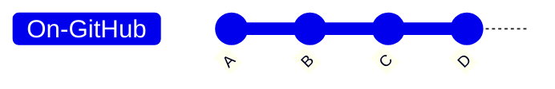
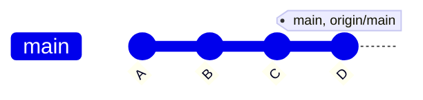
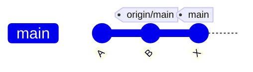
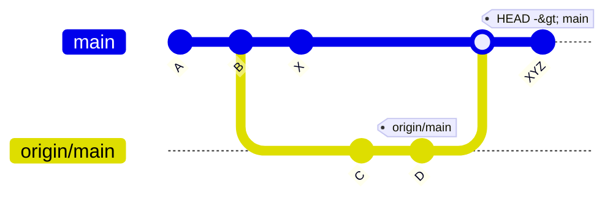

# Working With Remotes

## Checking Out Remote Tracking Branches

Let's say we have the following scenario: <br />
You cloned the main branch (clone a repo) and made two new commits to your local branch.
This means your remote branch (origin/main) is two commits behind.



The remote tracking branch `origin/main` point to commit `C`<br/>
and your local main branch point to commit `E`

if you will run `git status` you will see something like:

```text
Your branch is ahead of 'origin/main by 2 commits.
```

If you want see the state of the `origin/main`, <br />
A bookmark to the tracking branch state before the commits, last your a re communicate with GitHub

```bash
git checkout origin/main
```

This will enter you to `detached HEAD` state <br />
To switch back to your **local main branch**

```bash
git checkout main
```

> ⚠️ **_NOTE:_**
> `git checkout main` and `git checkout origin/main` are not the same

And if you want to push your changes, that you did on your local branch:

```bash
git push main
```


## Git Fetch and Git Pull

Here is a basic diagram illustrating the "locations" to help you understand the steps.



### Git Fetch

Git fetch update the remote tracking branch with the latest changes from the remote repository.

**Scenario**<br />
You cloned a repository and add a new commit. <br />
Meanwhile, your teammates pushed changes to the **remote branch** — changes that are not yet present in your local branch.

> **_NOTE:_**
> At this point, the remote-tracking branch `origin/main` is not yet aware of these changes.





If You don't want to screw up your working directory, but still want to have access to this changes, <br />
You can use git fetch:

```bash
git fetch origin

# If you have only one origin
git fetch

# Or if you want fetch only one branch
git fetch origin main
```



These change will not appear in your local directory (Workspace) <br />
And you will not see them in `git log --oneline --graph` unless you will run <br /> `git log origin/main --oneline --graph --decorate` <br />
But if you will run `git status`
You will see something like:

```text
Your branch is behind 'origin/main' by 3 commits, ...
```

And if I want see these changes:

```bash
git checkout origin/main
```

This will enter you to `detached HEAD` state (and you can create new brach from this state if you want) <br />
To switch back:

```bash
git checkout main
```

You can merge the changes if you want by run

```bash
# assuming you on the 'main' branch
git merge origin/main
```

For reminder about the git merge scenarios [understanding-git-merge](./understanding-git-merge.md)


### Git Pull

Update your current branch with whatever changes are on the remote tracking branch. <br/>
so basically `git pull` = `git fetch` + `git merge`

To pull, we specify the particular remote branch we want to pull using

```bash
git pull ROMOTE BRANCH
```

Just like `git merge`, **its matter where we run this command from.** <br />
Whatever branch we run it from is where the changes will be merge into. <br />
`git pull origin main` would fetch the lates information from the **origin main branch**,<br />
And merge those changes into our **current branch**

<br />

#### Scenario without conflict

You have a **local** repository with a `main` branch that you cloned. <br />
Commits `A` and `B` are the initial commits.



Your teammate pushes new commits `C` and `D` to the **remote** `main` branch.




You want to update your **local** `main` branch with those changes. <br />
by running `git pull origin main`


Commits `C` and `D` from the remote `origin/main` branch are fetched and merged into the local `main` branch.<br />
Git sees that `main` can simply "fast-forward" to `D`, because `main` has no new commits of its own.<br />
The `main` pointer just moves forward to `D`.

<br />

#### Scenario with conflict

You have a **local** repository with a `main` branch that you cloned. <br />
Commits `A` and `B` are the initial commits, and you add a new commit `X`. <br />
Thats mean my local branch `main` is ahead of 'origin/main by 1 commit.



In the same time your teammates pushed new commits `C`, `D` to remote branch `origin/main`


> For this scenario, we assume that both you and your teammates have made changes to the same file.

You want to push your changes to the remote branch, and it's always a good practice to pull the latest changes first.

```bash
git pull origin main
```

But you encounter a conflict.

```text
Auto-merging example.txt
CONFLICT (add/add): Merge conflict in example.txt
Automatic merge failed; fix conflicts and then commit the result.
```

As you already familiar with the [understanding-git-merge](./understanding-git-merge.md) section <br />
You will need to resolve the conflict in `example.txt`

```text
<<<<<<< HEAD
Line 2 changed in main
=======
Line 2 changed in remote
>>>>>>> commit-hash
```

```bash
git add example.txt
```

```bash
git commit -m "fix merge conflict"
```

At this point, when you run `git status` you will see that<br/> `Your branch is ahead of 'origin/main by 2 commit.`<br />
Your commit `X`, and the merge commit `XYZ`.



And what is left it just push these 2 commits,

```bash
git push origin main
```

And the `origin/main` also point now to the merge commit `XYZ`.

> ❗ **Remember**<br />
> When collaborating with teammates, it's generally best to work on separate feature branches rather than directly on the `main` or `master` branch.<br/>
> Changes should be merged using pull requests, ensuring a smoother workflow.<br/>
> I will cover this in more detail in the next sections.

<br />